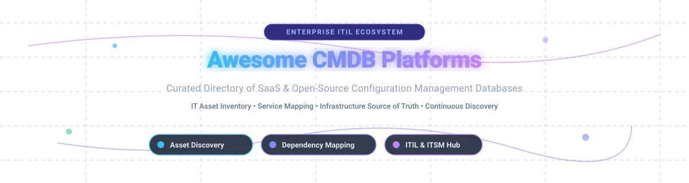

# Awesome Configuration Management Database (CMDB) 🚀

  
  
  
  
  

## 📌 Top Configuration Management Database (CMDB) Platforms Ecosystem

> **Curated directory of enterprise SaaS solutions and open-source GitHub projects for IT asset management (ITAM), Configuration Item (CI) dependency mapping, automated discovery, service mapping, and ITIL compliance.** 🛠️

📅 **Last updated: September 2026**

---

This repository tracks top **SaaS platforms** and **open-source software** for **Configuration Management Database (CMDB)** operations. CMDB systems serve as the single source of truth for infrastructure CIs, relationships, asset lifecycles, and dependency graphs across ITSM, DevOps, FinOps, and incident management workflows.

---

## 📑 Table of Contents

- [☁️ SaaS/Hosted CMDB Platforms](#%EF%B8%8F-saashosted-cmdb-platforms)
- [🔓 Open-Source GitHub Projects](#-open-source-github-projects)
- [💡 Implementation Playbooks & Insights](#-implementation-playbooks--insights)
- [🤝 How to Contribute](#-how-to-contribute)
- [💖 Support & Community](#-support--community)
- [📈 Star History](#-star-history)
- [⚠️ Disclaimer](#%EF%B8%8F-disclaimer)

---

## ☁️ SaaS/Hosted CMDB Platforms

> **Market Analysis**: The global Configuration Management Database (CMDB) and IT Asset Management (ITAM) market size is estimated at **$2.8 Billion** and is projected to reach **$5.2 Billion by 2030**. The sector is **moderately fragmented**, with enterprise heavyweights (ServiceNow, BMC) dominating large enterprise service mapping while specialized vendors (Device42, ManageEngine, Virima) capture mid-market hybrid cloud infrastructure discovery.

| Platform | Description | Enterprise Size / Valuation / Revenue | Starting Pricing Tier | Free Tier / Trial Limit |
| :--- | :--- | :--- | :--- | :--- |
| **[ServiceNow CMDB](https://www.servicenow.com/products/it-operations-management.html)** | Enterprise market leader with automated discovery, service mapping, AI-driven governance, and tight ITIL ITSM integration. | Public (NYSE: NOW) — ~$170B Market Cap (~$10.9B Annual Revenue) | ~$10,000/year base platform package | 30-day free developer instance via ServiceNow Developer Program |
| **[OpenText Universal CMDB](https://www.opentext.com/)** | Hybrid multi-cloud discovery, universal inventory, topology mapping, and enterprise IT operations management (formerly Micro Focus UCMDB). | Public (NASDAQ: OTEX) — ~$8.5B Market Cap (~$5.8B Annual Revenue) | ~$8,500/year enterprise suite license | 30-day free trial on OpenText Cloud / On-Premise evaluation |
| **[BMC Helix CMDB](https://www.bmc.com/it-solutions/bmc-helix.html)** | Enterprise configuration management database with dynamic service modeling, ITIL alignment, and cloud governance. | Private (KKR backed) — ~$5B Valuation (~$2.0B Annual Revenue) | ~$7,200/year starting enterprise license | 14-day hosted trial environment via BMC Helix Portal |
| **[ManageEngine CMDB](https://www.manageengine.com/)** | Comprehensive asset discovery, CI relationship mapping, and service desk integration for mid-market & enterprise. | Private (Division of Zoho Corp) — ~$1.5B+ Annual Revenue | $1,195/year for 250 node inventory | 30-day unlimited free trial (ServiceDesk Plus Cloud/On-Prem) |
| **[Device42](https://www.device42.com/)** | Infrastructure-centric CMDB with automated network discovery, IPAM, rack management, and dependency mapping. | Acquired by Freshworks — ~$500M Valuation (~$40M Annual Revenue) | $4,500/year base tier (up to 500 CIs) | 14-day full feature free trial (up to 2,000 devices) |
| **[InvGate Insight](https://invgate.com/)** | Unified IT asset discovery, CMDB relationship mapping, normalized software inventory, and vulnerability insight. | Private Growth-Stage — ~$25M Annual Revenue | $1,500/year base subscription | 30-day free cloud trial (unlimited node discovery) |
| **[Virima](https://www.virima.com/)** | Cloud & on-premise ITAM/CMDB with automatic discovery, visual dependency mapping, and ViVID service view dashboards. | Private Mid-Market — ~$15M Annual Revenue | $2,400/year base subscription | 30-day free trial (up to 250 assets discovered) |
| **[Xurrent CMDB](https://www.xurrent.com/)** | Modern cross-organization ITSM & CMDB platform designed for fast setup, service mapping, and SLA tracking (formerly 4me). | Private Bootstrapped/Venture — ~$12M Annual Revenue | $4.50/user/month (min 10 agents) | 30-day full access free trial |
| **[i-doit Commercial](https://www.i-doit.com/)** | Structured enterprise IT documentation, physical infrastructure tracking, compliance reporting, and CMDB Explorer views. | Private SMB/Enterprise — ~$10M Annual Revenue | €990/year (~$1,080/year) base license | 30-day free trial subscription |

---

## 🔓 Open-Source GitHub Projects

> Open-source CMDB software provides transparent relationship modeling, full data control, zero licensing fees, and extensible APIs for infrastructure engineering teams.

| Open-Source Project | Description | GitHub Stars |
| :--- | :--- | :--- |
| **[NetBox](https://github.com/netbox-community/netbox)** | Open-source network source of truth, IPAM, and DCIM platform serving as the primary infrastructure CMDB for network engineering. |  |
| **[Snipe-IT](https://github.com/snipe/snipe-it)** | Popular open-source IT asset management (ITAM) platform for software licenses, hardware lifecycles, and user assignments. |  |
| **[Spug](https://github.com/openspug/spug)** | Lightweight open-source deployment, configuration management, CMDB, task scheduling, and app monitoring platform. |  |
| **[GLPI](https://github.com/glpi-project/glpi)** | Comprehensive open-source IT asset management and service desk ecosystem with deep hardware/software inventory capabilities. |  |
| **[BlueKing BK-CMDB](https://github.com/TencentBlueKing/bk-cmdb)** | Enterprise-grade open-source CMDB designed for massive multi-cloud topologies, service topologies, and cloud-native application management. |  |
| **[OpsManage](https://github.com/welliamcao/OpsManage)** | Open-source automated operations, CMDB asset management, task execution, and code deployment system. |  |
| **[Adminset](https://github.com/guohongze/adminset)** | Automated DevOps platform integrating CMDB asset management, delivery pipelines, process execution, and monitoring. |  |
| **[Ralph](https://github.com/allegro/ralph)** | Datacenter and office hardware asset management system with rack visualization and lifecycle tracking (Apache 2.0). |  |
| **[Veops CMDB](https://github.com/veops/cmdb)** | Open-source enterprise CMDB focused on IT resource registration, CI relationship graphs, and automated synchronization. |  |
| **[Nautobot](https://github.com/nautobot/nautobot)** | Network automation platform and source-of-truth CMDB built on Django for network infrastructure data modeling. |  |
| **[iTop](https://github.com/Combodo/iTop)** | Web-based open-source CMDB with integrated ITIL service management desk, contract management, and incident response. |  |
| **[Open-CMDB](https://github.com/open-cmdb/cmdb)** | Lightweight open-source configuration item repository and API engine for custom asset schema definitions. |  |
| **[RackTables](https://github.com/racktables/racktables)** | Datacenter asset and IP address management (DCIM/IPAM) tool to map physical server racks, network switches, and patch panels. |  |
| **[DATAGerry](https://github.com/DATAGerry/DATAGerry)** | Flexible open-source CMDB allowing teams to build custom object types, field schemas, and RESTful export pipelines. |  |
| **[CMDBuild](https://github.com/CMDBuild/cmdbuild)** | Modular open-source CMDB framework to configure custom database schemas, workflow engines, and 3D datacenter maps. |  |

---

## 💡 Implementation Playbooks & Insights

- **Selecting i-doit or iTop**: Ideal when IT documentation, ITIL service management workflows, and compliance auditing are required within a single open stack.
- **Selecting NetBox or Nautobot**: Best for infrastructure-as-code (IaC) and network engineers looking for an authoritative source of truth (IPAM/DCIM).
- **Selecting GLPI or Snipe-IT**: Great fit for IT departments needing inventory tracking of laptops, licenses, software, and hardware alongside ticket management.
- **Enterprise SaaS Hybrid Strategy**: Large organizations often use commercial tools (**ServiceNow**, **BMC Helix**, **Device42**) for automated agentless discovery, multi-cloud dependency mapping, and compliance governance while feeding open-source telemetry into custom operational dashboards.

---

## 🤝 How to Contribute

Contributions are always welcome! 🛠️

1. **Fork** this repository.
2. Create a new feature branch (`git checkout -b feature/new-cmdb-tool`).
3. Add your entry to the appropriate table maintaining formatting & links.
4. Open a **Pull Request** with a clear title and description.

Please refer to the curated lists repository at [Awesome-Awesome-Awesome](https://github.com/ishandutta2007/Awesome-Awesome-Awesome) for contribution guidelines!

---

## 💖 Support & Community

If you find this repository helpful, please consider showing your support:

- ⭐ **Star this repository** to help others discover it!
- 🔀 **Fork it** to customize it for your team's internal documentation.
- 📢 **Share it** on LinkedIn, X (Twitter), or Reddit with fellow DevOps & ITSM engineers!
- ☕ **Buy me a coffee**: Support ongoing open-source maintenance via [GitHub Sponsors](https://github.com/sponsors/ishandutta2007).

---

## 📈 Star History

---

## ⚠️ Disclaimer

- This list is **community-curated** for educational and research purposes.
- Product logos, trademarks, and brand names belong to their respective owners.
- Continuous CMDB accuracy relies on continuous discovery and robust process governance.
